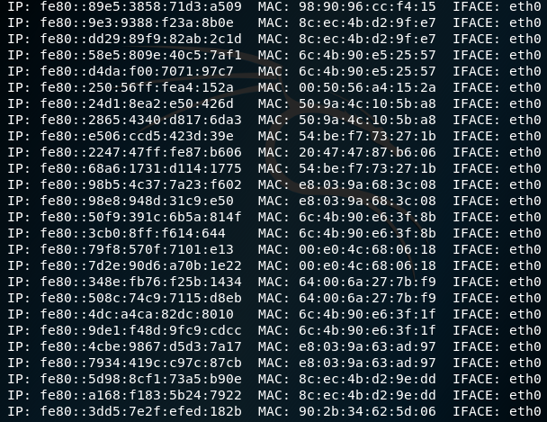
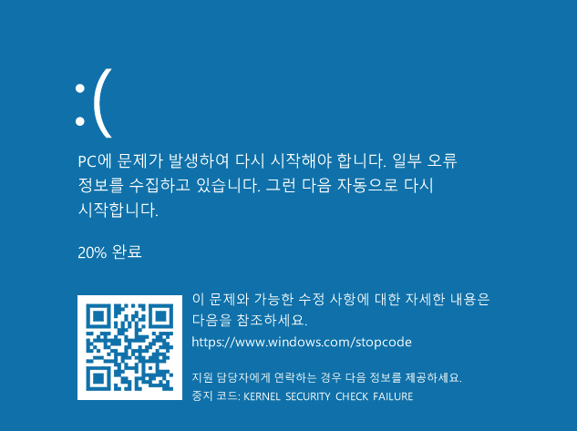
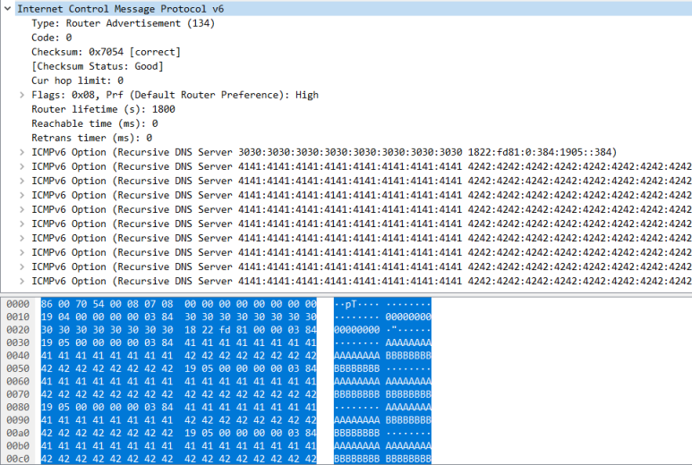
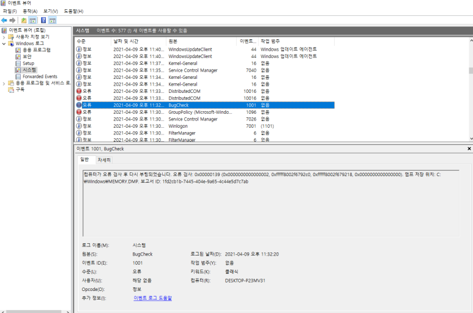
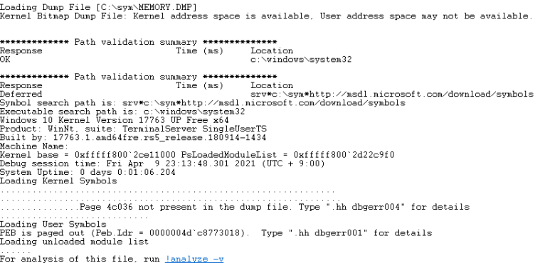
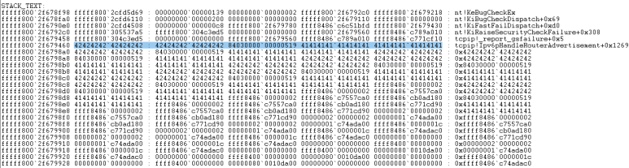

# [목차]
**1. [Environment](#Environment)**

**2. [Setting](#Setting)**

**3. [Exploit](#Exploit)**

**4. [etc](#etc)**


***


# **Environment**

| Type       | OS                                                      | Build                                 | Core | IP            | App          |
| :---       | :---                                                    | :---                                  | :--- | :---          | :---         |
| Victim     | Windows 10 1809</br>Windows 10 1909</br>Windows 10 2004 | 17763.379</br>18363.418</br>19041.264 | 1    | 192.168.0.114 |              |
| Attacker   | Kali 2019    	                                       |                                       |      | 192.168.0.32  | [exploit.py](https://github.com/2jinu/CVE/blob/main/DoS/%5BWindows%5D%20CVE-2020-16898/file/exploit.py) |

# **Setting**

인터페이스 번호 확인

```
C:\Windows\system32>route print
===========================================================================
인터페이스 목록
 13...........................Wintun Userspace Tunnel
  5...00 0c 29 e4 79 c9 ......Intel(R) 82574L Gigabit Network Connection
 15...00 ff be 6b 81 7c ......TAP-Windows Adapter V9
  1...........................Software Loopback Interface 1
===========================================================================
```

RA 기반 DNS 구성(RFC 6106) 활성화

```
C:\Windows\system32>netsh interface ipv6 set interface 5 rabaseddnsconfig = enable
확인됨
```

# **Exploit**

nmap ipv6 스캐닝

```
root@srv:~# nmap -6 --script=targets-ipv6-multicast-*
```



exploit.py에 target에 Victim의 ipv6값을 넣은 후 실행

Victim은 BSoD 발생



# **etc**

패킷 확인



이벤트 뷰어(eventvwr)에서 BSoD로 인한 dump파일 생성 확인



windbg 실행

```
windbg -y srv*c:\sym*http://msdl.microsoft.com/download/symbols -i c:\windows\system32 -z C:\sym\MEMORY.DMP
```

!analyze -y를 클릭하거나 입력하여 분석 시작



return 주소가 변조된것을 확인

